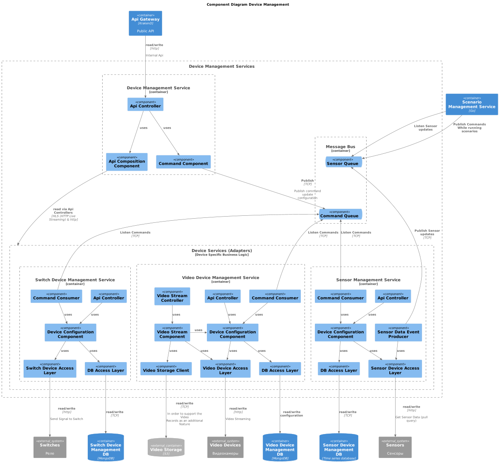
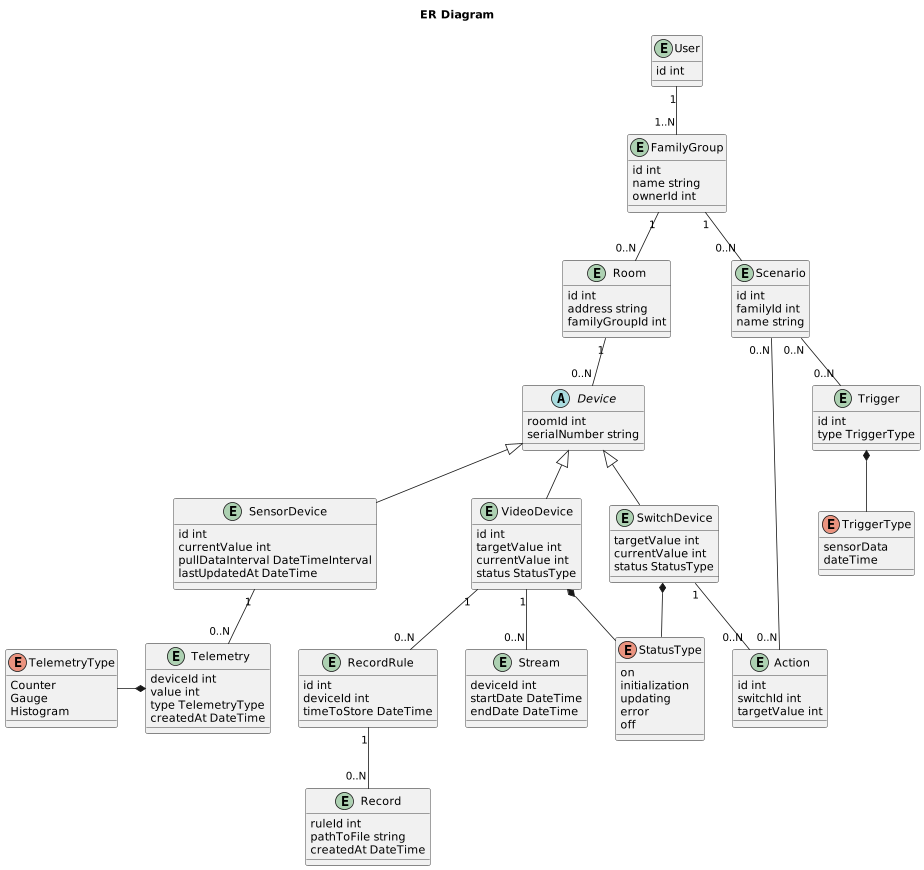

# Задание 1. Анализ и планирование

### 1. Описание функциональности монолитного приложения

**Управление отоплением:**

- Пользователи могут (в том числе использую UI в приложение) через http api (`/api/heating/...`):
    - Включить и выключить систему (POST `.../{id}/turn-(off|on)`)
    - Указать целевую температуру. (POST `.../{id}/set-temperature`)
    - Получить все доступные значения системы отобления (статус вкл/выкл, целевую температуру, текущую температуру) (GET `/{id}`)
- Система поддерживает управление системы по общему эндпоинту (PUT `.../{id}`), где можно указать
  и значение включения/выключения и целевое значение температуры.
- Обновление температуры происходит через запрос от сервера к реле

**Мониторинг температуры:**

- Пользователи могут (в том числе использую UI в приложение) через http api  
  получить значение текущей температуры. (`/api/heating/current-temperature`)
- Получение актуальных данных происходит через запрос от сервера к сенсорам.

**Подключение:**

- Каждая установка сопровождается выездом специалиста по подключению системы отопления в доме к текущей версии системы. 
- Самостоятельно подключить свой датчик к системе пользователь не может.

### 2. Анализ архитектуры монолитного приложения

**Приложение:**
- Язык программирования: Java (17, eclipse-temurin:17.0.5_8-jre-alpine)
- Framework: Spring

**Архитектура:**
- Монолит, все компоненты системы (обработка запросов, бизнес-логика, работа с данными) находятся в рамках одного приложения.
- Взаимодействие синхронное (HTTP api), запросы обрабатываются последовательно. Взаимодействие с СУБД стандартное (TCP/IP).
- Scalability: Ограничена, так как монолит сложно масштабировать по частям.
- Deployablility: Требует остановки всего приложения. Монолит докерезирован.
- Developability: Хорошее так как монолит не большой. При этом при расширение функционала эта характеристика может сильно страдать.
- Testability: Просто реализуется, т.к. монолит не большой, но тестов мало. При этом при расширение функционала эта характеристика может сильно страдать.
- Observability: Нет ни логов, ни метрик, ни проб.
- Relibility, fault-tolerance: нет ни таймаутов, ни circuit breaker, ни ретраив, ни стратегий graceful degradation
- Security: все запросы на порт 8080, механизмов авторизации и аутентификации не реализовано.

**Зависимости:**

- Lombok
- Servlet API
- База данных: PostgreSQL (15.5)

### 3. Определение доменов и границы контекстов

#### Анализ бизнес требований

##### Промежуточное состояние (через пару месяцев):
- Разработан MVP с разделёнными микросервисами для:
    - **управления отоплением**
    - **освещением**(включать и выключать свет)
    - **наблюдением**(видеокамеры)
    - **воротами**(запирать и отпирать автоматические ворота).
##### Финальное состояние (через год):
- Платформа экосистемы готова к подключению **до 100 экопоселков по 200 домов по пять устройств в каждом**.
- Экосистема доступна пользователю в режиме самообслуживания **по модели SaaS**. Пользователи могут самостоятельно подключать новые модули, управлять ими через интернет и настраивать автоматические сценарии работы устройств, просматривает телеметрию.
- Решение должно быть **легко расширяемым** - будут добавляться новая функциоанльность.
- Используются **стандартные протоколы** для подключения устройств умного дома. Модули управления и сами приборы (устройства) продаваться в отдельных комплектах для удобной покупки и подключения. Устройства подключаются к платформе через **доступ в интернет**.

##### Роли

- Пользователь - User (подключает устройство, использует веб-приложение);
- Администратор - Support;
- Команда по продажам - Seller. 

##### Сущности

- Устройство 
    - модуль управления/реле 
    - сенсор
    - видеокамера
- Сценарий работы устройства и Триггер сценария работы
- Телеметрия

 

##### Events 

- Пользователь подключает/отключает Устройство
- Пользователь регистрирует/удаляет Дом
- Пользователь просматривает Телеметрию:
    - температуру.
    - уровень освещения
    - закрытие ворот
    - другое (абстрактное значение в % или определенном диапазоне).
- Пользователь изменяет состояние устройства:
    - температуру.
    - уровень освещения
    - закрытие ворот
    - другое (абстрактное значение в % или определенном диапазоне).
- Пользователь программирует Сценарий работы устройства.
- Система запускает сценарий работы на Триггер сценария работы
- Система получает Телеметрию / Устройство предоставляет телементрию Системе.

##### VO

- Диапазон значений (рамки для значения устройства: true/false, 1-100%, и т.д. )
- Целевое значение
- Текущее значение
- Время старта сценария
- Статус устройства (on/off, активность)
- Место расположения устройства (Комната, Дом, Экопоселок)

#### Выделение доменов

- Управление устройствами. (Actor: user, support)
- Управление сценариями. (Actor: user, support)
- Управление пользователями. (Actor: user, support)

#### Разделение на поддомены

- Управление устройствами.
    - Управление сенсорами
    - Управление реле
    - Видеонаблюдение
- Управление сценариями
    - Создание сценария
    - Управление триггерами для сценария (напр. по времени, по данным от сенсора, по установке нового значения на модуль управления)
- Управление пользователями
    - Управление пользователями и правами

[plantUML domain model](./Domain_Model.puml)

#### Определение контекстов

- Управление устройствами.
    - Управление сенсорами
        - Регистрация сенсора
        - Получение текущего значения
    - Управление реле
        - Регистрация реле
        - Установка целевого значения
    - Видеонаблюдение
        - Регистрация камеры
        - Установка целевого значения (поворота, если доступно)
        - Получение картинки (видео потока).
- Управление сценариями
    - Конфигурация сценария
        - Создание/изменение сценария
        - Выполнение сценария
    - Управление тригерами для сценария
        - Создание правила активации
        - Мониторинг активации (момента когда сценарий нужно активировать)
- Управление пользователями
    - Управление пользователями и правами
        - Регистрация и Аутентификация пользователя
        - Управление правами пользователя

[plantUML context model](./Context_Model.puml)

#### Контекстные карты

[plantUML context map](./Context_Map.puml)

### 4. Проблемы монолитного решения

- Scalability. Монолит можно скейлить только целиком. Из-за этого возможны проблемы с управлением ресурсами. Кроме того отдельный инстанс монолита стартует как правило дольше чем инстанс сервиса. 
- Security. Выделение отдельного сервиса для управления пользователями позволяет отделить работу с конфеденциальной информацией от работы с менее чувствительными, обезличенными данными.
- fault-tolerance, recoverability.Например: Ошибки связанные с видионаблюдением могут влиять на функционал контроля отопления. Также ошибки в не монолитной системе более локализованы, а значит востановление более простое.
- modularity. Реализация в монолите более подвержена рискам написания связного кода и менее очевидна необходимость фиксации контрактов. Это приводит к более масштабным изменениям в коде при появлении новых бизнес требований. 

### 5. Визуализация контекста системы — диаграмма С4

[PlantUml Context Diagram](./Context_Diagram.puml)

# Задание 2. Проектирование микросервисной архитектуры

**Диаграмма контейнеров (Containers)**

[PlantUml Container Diagram](./Container_Diagram.puml)

**Диаграмма компонентов (Components)**

1. User Management Service

[Component Diagram User Management](./Component_Diagram_User_Management.puml)

2. Device Management Services

[Component Diagram Device Management.puml](./Component_Diagram_Device_Management.puml)

3. Scenario Management Services

[Component Diagram Scenario Management.puml](./Component_Diagram_Scenario_Management.puml)

**Диаграмма кода (Code)**

[Component Diagram Scenario Management.puml](./Code_DeviceManagementService.puml)

# Задание 3. Разработка ER-диаграммы

[ER Diagram](./ER_Diagram.puml)
